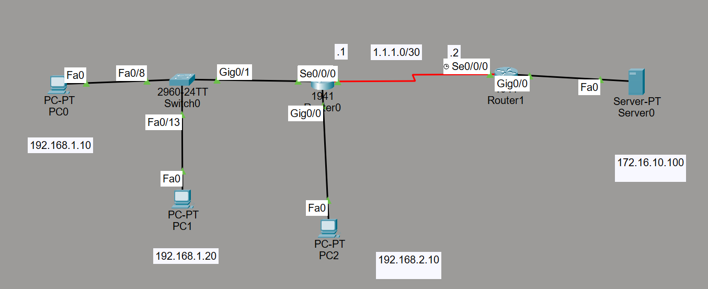

# CPT-Standart-ACL-Yapılandırması

Bu projede, Cisco Packet Tracer kullanılarak oluşturulmuş bir **statik yönlendirme topolojisi** üzerinde **standart ACL yapılandırması** yapılmıştır. Bu yapılandırma ile **192.168.1.10** IP adresine sahip olan cihazın, **sunucuya** erişimine izin verilmiş, diğer cihazların erişimi engellenmiştir.

## Proje Detayları

### Kullanılan Cihazlar:
- **3 PC**
- **1 Switch**
- **2 Router**
- **1 Server**

Aşağıda Standart ACL yapısının genel topolojisi gösterilmektedir:

`.pkt` dosyasını indirip Packet Tracer ile açarak inceleyebilirsiniz.

# CPT-Standard-ACL-Configuration

In this project, a **static routing topology** has been created using Cisco Packet Tracer, and a **standard ACL configuration** has been implemented. With this configuration, the device with the IP address **192.168.1.10** is allowed to access the **server**, while access from other devices is blocked.

## Project Details

### Devices Used:
- **3 PCs**
- **1 Switch**
- **2 Routers**
- **1 Server**

You can download the `.pkt` file and open it in Cisco Packet Tracer to review the topology and configuration.
