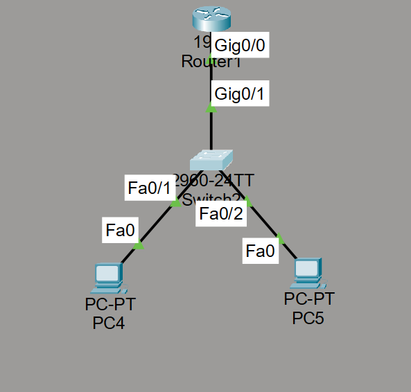

# CPT-Router-on-a-Stick-Yapılandırması

Bu projede, **Cisco Packet Tracer** kullanılarak **Router-on-a-Stick** yapısı uygulanmıştır. Bu yapı sayesinde farklı VLAN’lar arasındaki iletişim, bir router üzerindeki alt arayüzler (sub-interface) aracılığıyla sağlanmaktadır.

## Proje Detayları

### Kullanılan Cihazlar:
- **2 PC**
- **1 Switch**
- **1 Router**

### VLAN Yapılandırması:
- **VLAN 10**:  
  - IP Adresi: **192.168.10.5**
- **VLAN 20**:  
  - IP Adresi: **192.168.20.5**

### Router Yapılandırması:
- **GigabitEthernet0/1.10** → VLAN 10 için  
  - IP Adresi: **192.168.10.1**
  - Encapsulation: `dot1Q 10`
- **GigabitEthernet0/1.20** → VLAN 20 için  
  - IP Adresi: **192.168.20.1**
  - Encapsulation: `dot1Q 20`

### Switch Yapılandırması:
- **VLAN 10** ve **VLAN 20** oluşturulmuştur.  
- **PC1** VLAN 10’a, **PC2** VLAN 20’ye atanmıştır.  
- **Router’a bağlı port**, **Trunk portu** olarak yapılandırılmıştır.

Aşağıda Router On a Stick yapısının genel topolojisi gösterilmektedir:

## `.pkt` Dosyası:
Bu projeye ait `.pkt` dosyasını indirip **Cisco Packet Tracer** ile açarak VLAN yapılandırmasını ve Router-on-a-Stick bağlantısını inceleyebilirsiniz.

---

# CPT-Router-on-a-Stick-Configuration

In this project, a **Router-on-a-Stick** configuration has been implemented using **Cisco Packet Tracer**. This setup allows inter-VLAN communication through sub-interfaces configured on a single router.

## Project Details

### Devices Used:
- **2 PCs**
- **1 Switch**
- **1 Router**

### VLAN Configuration:
- **VLAN 10**:  
  - IP Address: **192.168.10.5**
- **VLAN 20**:  
  - IP Address: **192.168.20.5**

### Router Configuration:
- **GigabitEthernet0/1.10** → for VLAN 10  
  - IP Address: **192.168.10.1**
  - Encapsulation: `dot1Q 10`
- **GigabitEthernet0/1.20** → for VLAN 20  
  - IP Address: **192.168.20.1**
  - Encapsulation: `dot1Q 20`

### Switch Configuration:
- **VLAN 10** and **VLAN 20** have been created.  
- **PC1** is assigned to VLAN 10 and **PC2** to VLAN 20.  
- The port connecting to the router is configured as a **Trunk port**.

## `.pkt` File:
You can download the `.pkt` file and open it with **Cisco Packet Tracer** to explore the VLAN setup and Router-on-a-Stick configuration.
