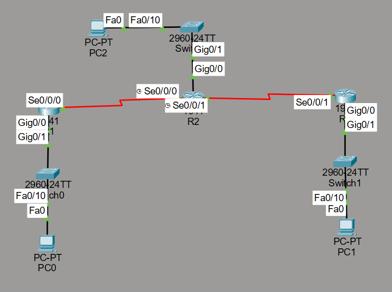

# CPT-RIPv2-Yönlendirme-Yapılandırması

Bu projede, **Cisco Packet Tracer** kullanılarak **RIPv2 (Routing Information Protocol Version 2)** yapılandırması gerçekleştirilmiştir. Bu yapı sayesinde yönlendiriciler (router’lar) dinamik olarak yönlendirme bilgilerini birbirleriyle paylaşabilmektedir.

## Proje Detayları

### Kullanılan Cihazlar:
- **3 Router**
- **3 Switch**
- **3 PC**

### Yapılandırma Özeti:
- Tüm router’larda **RIPv2** etkinleştirilmiştir.  
- Her router’da **GigabitEthernet0/0** arayüzü **passive interface** olarak ayarlanmıştır; böylece bu arayüz üzerinden RIPv2 yönlendirme bilgisi gönderilmez veya alınmaz.  
- **R2** üzerinde bir **default route** tanımlanmıştır.  
- R2, bu default rotayı diğer router’larla paylaşmak için `default-information originate` komutu kullanılarak yapılandırılmıştır.  
- Bu sayede **R1** ve **R3**, R2 üzerinden **default route** bilgisine dinamik olarak erişmektedir.

Aşağıda RIPv2 yönlendirme yapısının genel topolojisi gösterilmektedir:

## `.pkt` Dosyası:
Bu projeye ait `.pkt` dosyasını indirip **Cisco Packet Tracer** ile açarak RIPv2 yapılandırmasını ve dinamik yönlendirme sürecini inceleyebilirsiniz.

---

# CPT-RIPv2-Routing-Configuration

In this project, **RIPv2 (Routing Information Protocol Version 2)** has been configured using **Cisco Packet Tracer**. This setup enables routers to share routing information dynamically across the network.

## Project Details

### Devices Used:
- **3 Routers**
- **3 Switches**
- **3 PCs**

### Configuration Summary:
- **RIPv2** is enabled on all routers.  
- The **GigabitEthernet0/0** interface on each router is configured as a **passive interface**, preventing RIPv2 updates from being sent or received on local networks where it’s unnecessary.  
- A **default route (0.0.0.0)** has been configured on **R2**.  
- R2 uses the `default-information originate` command to advertise this default route to the other routers.  
- As a result, **R1** and **R3** dynamically learn the default route from R2.

## `.pkt` File:
You can download the `.pkt` file and open it with **Cisco Packet Tracer** to explore the RIPv2 configuration and dynamic routing behavior.
